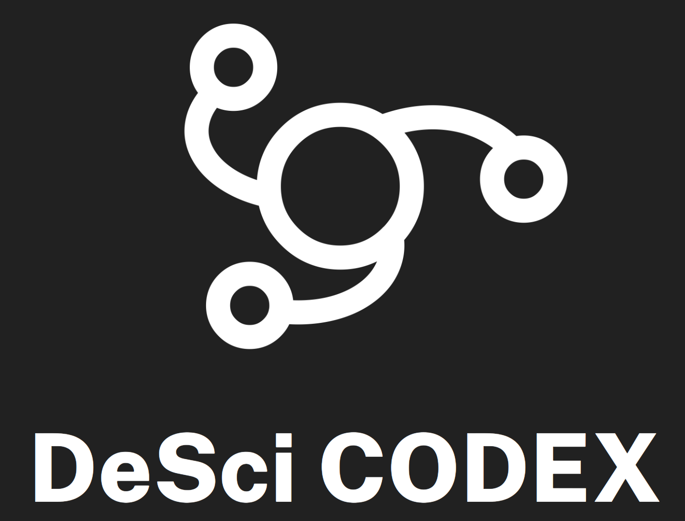

This repo contains a reference implementation for the next generation of the protocol, built on [Ceramic](https://ceramic.network/) and [ComposeDB](https://composedb.js.org/docs/0.5.x/introduction). It includes data models and an extensive test suite to ensure correct functionality, but also example data population and a GraphiQL interface to explore the protocol structure.

The repo consists of several packages:
- [the codex integration library](./packages/lib/README.md)
- [composedb models and test env](./packages/composedb/README.md)
- [a codex CLI](./packages/cli/README.md)


By default, the tests and scripts run against a local Ceramic/ComposeDB node with the bundled IPFS server, uses the `inmemory` network for anchoring, and writes all data and logs to `local-data`.

The protocol documentation can be found [here](https://codex.desci.com)!

## Getting started

1. Install dependencies:

```bash
nvm use # or otherwise ensure the use of node v20
npm ci # install deps
```

> At this point, `make test` can be run to automatically setup a local environment and run the test suite.

2. Generate your own seed, admin DID, and ComposeDB configuration file:

```bash
npm run -w packages/composedb generate
```

3. Finally, start the services:

```bash
npm run -w packages/composedb dev
```

This will start a composeDB node, compile the models into composites, and deploy the composites to a local network. Now, you can open [http://localhost:5001](http://localhost:5001) for the GraphiQL interface and explore the data models. This environment is what is being used in the tests.

> Without running this step, the composite runtime definitions will not be available and hence typescript may be temporarily sad

4. If you want to experiment with some actual queries, you can run this command to publish a bit of data from a couple of random DID's:

```bash
npm run -w packages/lib populate
```

After this is done, your GraphQL queries should return some actual data!


## Test suite

There is a test suite running through API operations demonstrating the functional protocol requirements, by generating random DID's and performing create and mutation operations. Before each run, it will remove the remains of the last test execution.

The test setup clones your user configuration, but changes storage to `local-data/ceramic-test` not to interfere with prepopulated data. It will refuse to run if `npm run dev` is already active.

```bash
make test
```

### Stop hung services
If the test doesn't exit nicely, there may be IPFS and Ceramic daemons still hanging around. When restarting the tests, it may nag about not wanting to clobber those services. If this happens, run:

```bash
make test-stop
```

## Reset

To reset to a clean state, deleting everything except generated seed and user config:

```bash
make clean
```

## Feedback

If you want to discuss any part of the protocol from a practical or theoretical perspective, come on in to our [Discord](https://discord.gg/A5P9fgB5Cf)! This is a community effort, and your thoughts and opinions will help shape its future.
