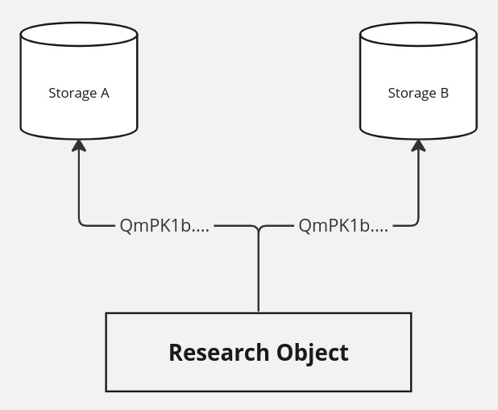

# 📦 Data services

Maintenance of the protocol itself relies on the community running nodes to pin and index the relational data of the graph according to the implementation. The data entities in the protocol are designed to minimize the storage complexity of this participation. It is important to point out this does not include the data DAG linked from the research objects because it's orders of magnitude larger, and cannot be included simply from cost of storage.

This begs the question: how can the protocol facilitate long-term safekeeping without a formal guarantee of data availability? The answer is diversity in active storage providers, and being able to choose level of persistence guarantees by potentially combining several of them. Not being reliant on a single organization for storage is great for long term survivability, and from content addressed storage we can have deterministic resolution even if the data location changes.

A gateway providing the facilities to create research objects and other entities will likely take on the responsibility of data handling for the end user. That means helping the user to upload data and make sure it is continually pinned, either by providing this service themselves, or by cooperating with other actors in the field that provide pinning services.

A central point is that the protocol is open by design to different solutions to this data storage problem, and tries to separate that from the maintenance of the contextual data. This is a good thing for end-users because there can be continuous development in this area, with a competitive economy around data services. Some could provide hot storage for frequently accessed resources, others very competitive archival storage rates by interfacing with storage protocols like [Filecoin](https://filecoin.io/) or [Arweave](https://www.arweave.org/). Both of these services are very hard to get right for smaller institutions that aren't mainly in the business of running compute and storage infrastructure.

## Storage deduplication

There are more advantages in using content addressed storage than location independence, it's also quite efficient in deduplicating stored data. If two research objects use the same large file, a pinning provider only needs to store it once, because if it has the same hash, it _is_ the same data. This optimization happens automatically when pinning data with IPFS.

<figure><figcaption>
Research object data DAG being pinned in multiple locations, with the same address
</figcaption></figure>

## Compute over data capabilities

A publication with results based on large datasets are naturally difficult to reproduce because of the challenges in moving large amounts of data. Content addressed storage opens up for distributed compute over data technologies like [Bacalhau](https://www.bacalhau.org/). In this case, a storage provider could also run Bacalhau nodes, allowing users to send compute jobs to reproduce results to execute on the same site where the data is stored, on capable machines. This efficiently avoids costs associated with data egress and maintaining their own compute infrastructure.
